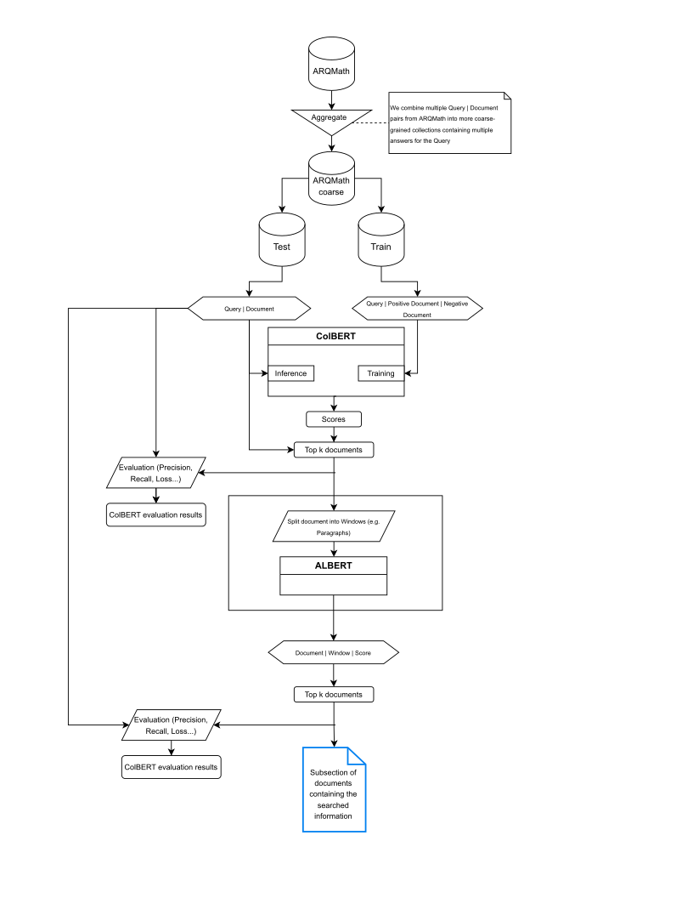

# MathIR
Welcome to the MathIR repository. This retrieval system is built around ColBERT and ALBERT to query mathematics related datasets in a piece-wise fashion. The following image shows architecture of the system:



## Setup
After Cloning this repository:

### Download Dataset and ColBERT checkpoints

To download the dataset, checkpoints and indexes got to https://drive.google.com/drive/folders/15jWaEAD85A5DTr3CA_rPhNvoOHo8Uhak?usp=sharing where you find the directories
```
    ARQMathAgg/
    ColBERTCheckpoints/
```
Download these and put their contents in the appropriate folders in the repository (or anywhere else, but then you'll need to adapt the paths in the scripts)


### Clone the ColBERT source
As our scritps rely on ColBERT, we require the colBERT source to be cloned into the directory. Run
``` 
git clone https://github.com/stanford-futuredata/ColBERT.git
```
in the root directory of this repository or link the directory of the ColBERT repository such that ColBERT is accessible at ```ColBERT/```


### Install the needed dependencies
While ALBERT works out of the box via the HuggingFace library, refer to https://github.com/stanford-futuredata/ColBERT to install all the necessary dependencies to run ColBERT.


## Dataset
### Build Dataset
Skip if you downloaded the dataset.

1. Download ARQMath from https://drive.google.com/drive/folders/1YekTVvfmYKZ8I5uiUMbs21G2mKwF9IAm into ```ARQMath/raw/```.

2. Clone ARQMath Code Repo: https://github.com/ARQMath/ARQMathCode into ```DatasetProcesssing/ARQMathCode```.

4. Run ``get_clean_json.py``.

5. Set configuration in ``create_aggregate_dataset.py`` and run the script.

### Dataset Structure
The dataset consists of the following files:

- ```queries_train.tsv```: Tab seperated values file containing the training query IDs (qid) and their corresponding query text.

- ```queries_test.tsv```: Tab seperated values file containing the test query IDs (qid) and their corresponding query text.

- ```collection_train.tsv```: Contains document IDs (pid) and their corresponding text for training, with both positive and negative examples.

- ```collection_test.tsv```: Contains document IDs (pid) and their corresponding text for testing, with both positive and negative examples.

- ```triples_train.jsonl```: Contains training query IDs (qid) paired with positive (pid+) and negative document IDs (pid-).

- ```triples_test.jsonl```: Contains test query IDs (qid) paired with positive (pid+) and negative document IDs (pid-).

- ```qrel_train```: Contains relevance labels for the training dataset, mapping query IDs to relevant document IDs.

- ```qrel_test```: Contains relevance labels for the test dataset, mapping query IDs to relevant document IDs.

- ```aggregates/collection_agg_test.json```: Json file containing a list of dictionaries mapping a random aggregation of one correct and one to three other document IDs to the corresponding query id.

- ```aggregates/collection_agg_test.json```: Json file containing a list of dictionaries mapping a random aggregation of one correct and 24 to 30 other document IDs to the corresponding query id.

## ALBERT
### Evaluation
Adapt settings in and run ```MathIR_Eval_Colbert.py``` to generate an ```Evaluation/ALBERT/.../run``` (optional, if it already exists) and ```Evaluation/ALBERT/.../res.csv``` files, where the json file holds the results for all evaluated metrics. You might include additional metrics or adapt the evaluated metrics by adjusting the python script. For further information we refer to the *ir-measures* python library (https://ir-measur.es/en/latest/) we used.

## ColBERT
Skip Training and Indexing if you downloaded the checkpoints and indexes.

### Training
Although resouce intensive, training ColBERT is an easy task. Just set your desired configuration or adapt the set parameters in ```ColBERTScripts/ColBERT_train.py``` (or leave them as they are) and run the python script.

### Indexing
To index the collection_test.tsv part of the dataset set the paths in and run the file ```ColBERTScripts/ColBERT_index.py```. This will take quite some memory and time (we do not recommend to index the test dataset, unless you know you have the resources available). Furthermore, note that an out-of-memory error during indexing can be mitigated by adapting line 121 (```batch_size = 2 ** 20```) in ```ColBERT/colbert/search/index_storage.py``` within your cloned ColBERT source.

### Evaluation
Adapt settings in and run ```MathIR_Eval_Colbert.py``` to generate an ```Evaluation/ColBERT/.../run``` (optional, if it already exists) and ```Evaluation/ColBERT/.../res.csv``` files, where the json file holds the results for all evaluated metrics. You might include additional metrics or adapt the evaluated metrics by adjusting the python script. For further information we refer to the *ir-measures* python library (https://ir-measur.es/en/latest/) we used.


## MathIR System

### Running the System - Usage Example
Set the configuration in ```MathIR.py``` (or leave as is) and run ```python MathIR.py```.

```
Input your Query: 
What is Cauchy's Theorem for holomorphic functions?


Results:
[0 (0.9995328187942505)]:   He is talking about the following theorem: Looman–Menchoff theorem,  if f is continuous, u and v have first partial derivatives (but not necessarily continuous), and they satisfy the Cauchy–Riemann equations, then f is holomorphic. I haven't heard about this, but simply get it from wiki.

... (some more results) ...

[3 (0.9985989928245544)]:   I would state the "fundamental theorem of contour integration" as follows. Fundamental Theorem of Contour Integration: Let $U\subseteq\mathbb{C}$ be an open set, and let $f\colon U\to \mathbb{C}$ be a continuous function. Then the following conditions are equivalent:  $f$ has an antiderivative on $U$. For every piecewise differentiable closed curve $\gamma$ in $U$, the integral $\int_\gamma f\,dz = 0$.  Notice that the theorem does not say that all holomorphic functions necessarily satisfy the two equivalent conditions. In fact, there are situations where they won't. For instance, if $U = \mathbb{C}\smallsetminus\{0\}$ and $f(z) = 1/z$, then $f$ does not have an antiderivative on $U$, even though it is holomorphic. The Cauchy-Goursat theorem tells us one situation in which holomorphic functions are guaranteed to satisfy conditions (1) and (2). Cauchy-Goursat: Let $U\subseteq\mathbb{C}$ be a simply connected open set. Then all holomorphic functions $f\colon U\to \mathbb{C}$ satisfy the equivalent conditions of the previous theorem.

... (even more results) ...
```


### End-to-end Evaluation
Adapt settings in and run ```MathIR_Eval_Full.py``` to generate an ```Evaluation/Full/.../run``` (optional, if it already exists) and ```Evaluation/Full/.../res.csv``` files, where the json file holds the results for all evaluated metrics. You might include additional metrics or adapt the evaluated metrics by adjusting the python script. For further information we refer to the *ir-measures* python library (https://ir-measur.es/en/latest/) we used.